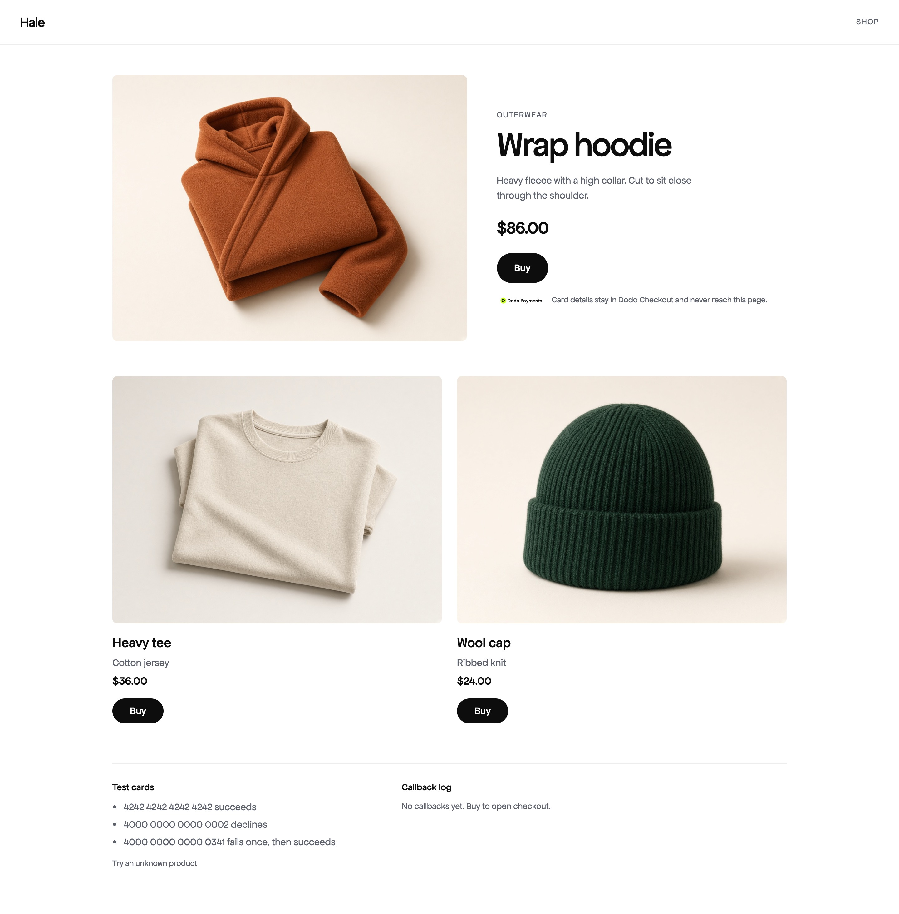
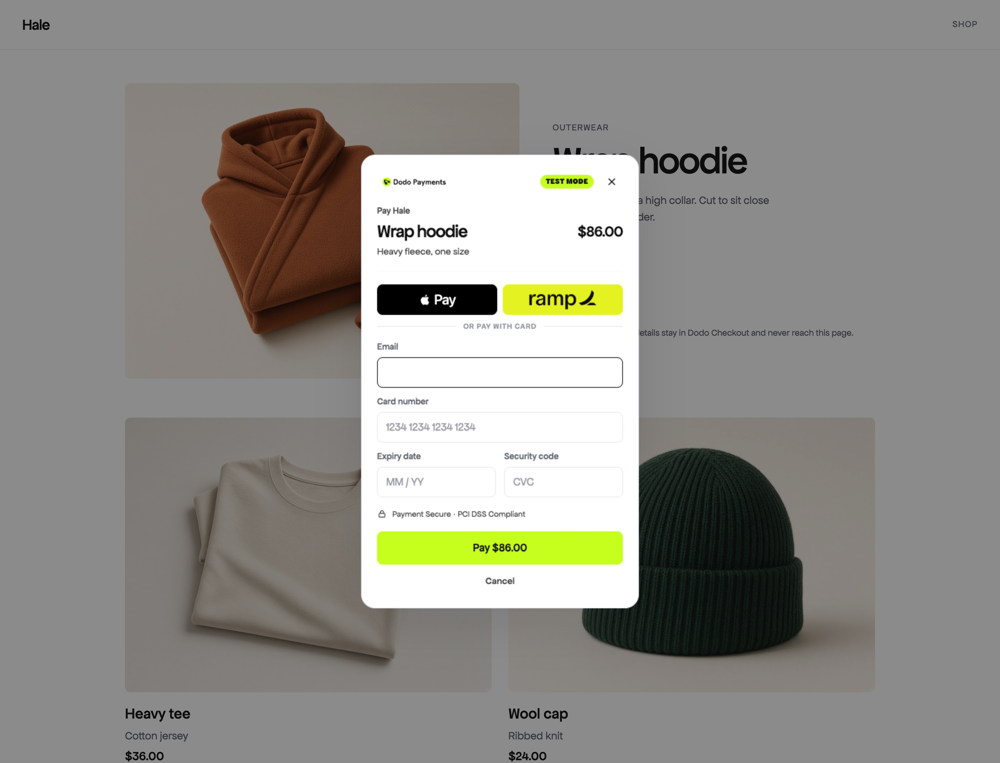
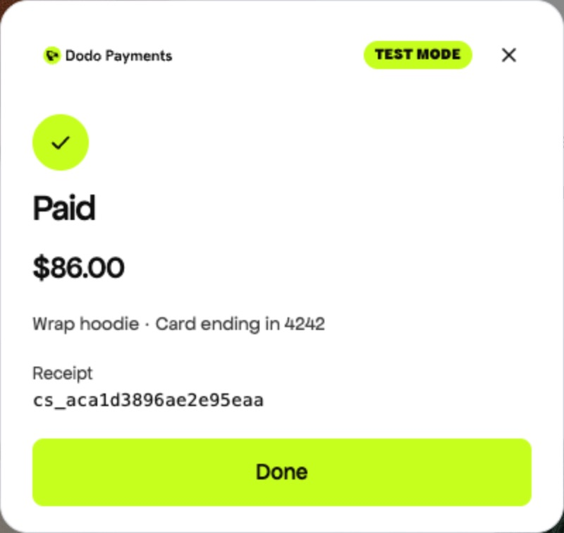

# Embeddable Dodo Checkout

One script. The customer stays on the store. The card never enters the store's JavaScript.

**[Open the store](https://dodotest-store.vercel.app)** · **[Checkout origin](https://dodotest-checkout.vercel.app)** · **[Source](https://github.com/XIVASSS/dodotest)**

Send the store link. That is the demo. The checkout link is the other origin, where the card form is hosted.

## Three pieces

| Piece | Where | What it does |
| --- | --- | --- |
| SDK | `packages/sdk/src/index.ts`, served as `dodo.js` | One script. `DodoCheckout.open({ productId, onSuccess, onClose, onError })` |
| Checkout | `apps/checkout`, [dodotest-checkout.vercel.app](https://dodotest-checkout.vercel.app) | Product, email, card, pay. The fake charge happens here. No server |
| Store | `apps/demo`, [dodotest-store.vercel.app](https://dodotest-store.vercel.app) | Hale. Buy opens the checkout on the page. A log shows the callbacks |

The store is Hale. Each Buy calls `DodoCheckout.open({ productId })`. The price on the Pay button comes from the checkout catalog, so the page cannot talk the charge into a different amount.

| Product | Id | Charged |
| --- | --- | --- |
| Wrap hoodie | `prod_hoodie` | $86.00 |
| Heavy tee | `prod_tee` | $36.00 |
| Wool cap | `prod_cap` | $24.00 |



## Checkout

The modal is Dodo, drawn inside an iframe on another origin. The store can pass a product id and an optional email. It cannot pass a price, a name, or HTML. Apple Pay and Ramp are shown on the form. In this test only the card charges. Opening the checkout address on its own explains that split and still lets you pay for the hoodie.



A successful charge shows a receipt, then closes. The host is told the session, the product, and the amount in cents. The receipt inside the checkout shows the last four digits. The card number is not sent back.



## The host learns the truth

`onSuccess` fires as soon as the charge succeeds, with the amount the checkout actually charged. `onClose` fires only after the receipt is dismissed. A decline fires `onError` and leaves the form open.


## Run

```bash
npm install
npm run dev
```

Open the store at [http://localhost:5173](http://localhost:5173). The checkout app is [http://localhost:5174](http://localhost:5174). They are different origins on purpose.

The store loads `dodo.js` from `VITE_CHECKOUT_ORIGIN` (`http://localhost:5174` in `apps/demo/.env`). To point a build at another checkout host, set that variable and rebuild the SDK with the same origin:

```bash
CHECKOUT_ORIGIN=https://checkout.example.com npm run build -w @dodo/sdk
```

## What the store can do

```html
<script src="http://localhost:5174/dodo.js"></script>
<script>
  DodoCheckout.open({
    productId: "prod_hoodie",
    onSuccess: ({ sessionId }) => {},
    onClose: ({ reason }) => {},
    onError: ({ code, message }) => {},
  });
</script>
```

`productId` is required and must match `^[A-Za-z0-9_-]{1,64}$`. An optional `email` is a prefill only.

`DodoCheckout.close()` asks the checkout to close. It does nothing while a payment is in flight. A second `open()` focuses the checkout that is already open.

`onSuccess` receives `{ sessionId, productId, amount, currency }`. `amount` is in minor units (`8600` means $86.00). `onClose` receives `{ reason: "success" | "dismissed" | "error" }` only after the UI is gone.

Test cards, any future expiry, any 3-digit CVC, and any valid email:

| Card | Result |
| --- | --- |
| `4242 4242 4242 4242` | Succeeds |
| `4000 0000 0000 0002` | Declines, checkout stays open |
| `4000 0000 0000 0341` | Fails once, then succeeds |

## How the pieces talk

1. The SDK creates a nonce, locks page scroll, and mounts a full-viewport iframe at the checkout origin with `productId`, `nonce`, and `parentOrigin`.
2. The iframe is sandboxed with `allow-scripts allow-forms allow-same-origin` and no top navigation. Its referrer policy is `no-referrer`.
3. The checkout posts `{ source: "dodo-checkout", version: 1, nonce, type, payload }` only to `parentOrigin`.
4. The SDK ignores messages whose `origin` is not the checkout origin, whose `source` window is not this iframe, or whose nonce does not match. It never uses `"*"` as a target.
5. On `ready`, the SDK sends `init` with the optional email. Email is not put in the URL.
6. If `ready` does not arrive within 8 seconds, the SDK removes the iframe and reports `checkout_unavailable`.

Card number, expiry, CVC, and email are not posted back. The attempt count for the retry card is a hash in the checkout origin's `sessionStorage`, so a close and reopen in the same tab still retries correctly.

## Decisions

**Iframe, not a popup.** A popup isolates the card form and also gets blocked, and it feels like leaving the page. A full-viewport iframe on another origin keeps the customer on the store and keeps the card fields out of the store's DOM. The scrim and dialog are drawn inside the iframe so the store cannot restyle the amount or the Pay button. The store can still paint HTML over the iframe. A server-created session and a merchant allowlist would be the next defense. Clicking the scrim does nothing, so a stray click does not discard a half-entered card.

**A decline does not close the checkout.** `onError` fires immediately, the form stays filled, and `onClose` waits until the customer actually leaves. The store learns the truth without treating a failed card as "the customer dismissed the payment."

The visual design is locked. The store can prefill an email and nothing else. The checkout uses the Dodo brand kit: Green Pulse `#C6FE1E`, Blue Stride `#1264FF`, Eclipse Black `#0D0D0D`, Dodo Mist `#F6F7F9`, and White Stream `#FFFFFF`, with Apfel Grotezk for headlines, buttons, and form text.

## Next

Create the session on a server so the price is not shipped in the client bundle. Treat `onSuccess` as a hint and confirm with a webhook. Add an idempotency key so a double submit cannot capture twice. Then collect billing country and tax, which a Merchant of Record needs and this fake charge does not.
